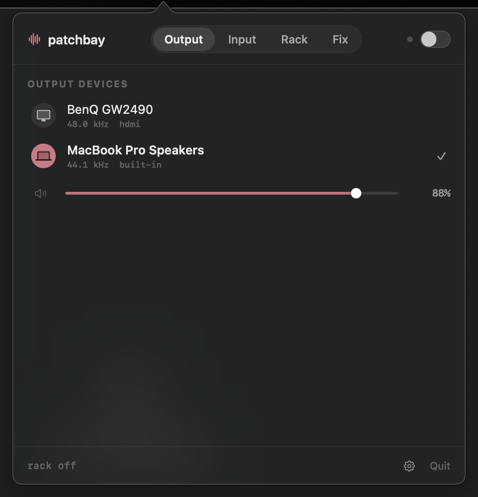
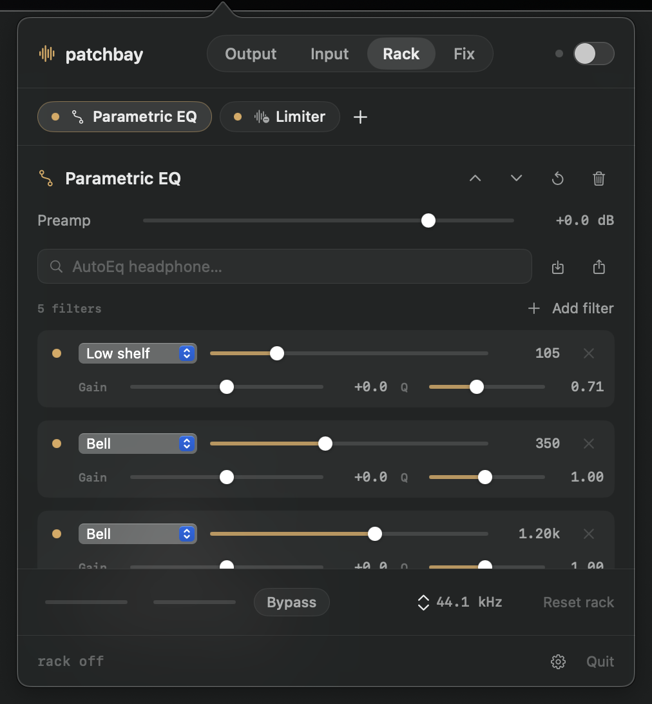

# patchbay

A native, open-source DSP rack and per-app router for macOS system audio. No virtual audio driver for output; an optional one for the microphone.

<p align="center">
  
  
</p>

## What it does

- **Modular effects chain** on all system audio, reorderable by drag, up to 16 modules:
  - Tone: Gain, Parametric EQ (up to 32 bands: bell, shelves, pass, notch), 16-band Graphic EQ, Filter (12–48 dB/oct), Loudness
  - Character: Bass enhancer, Exciter, Crystalizer, Crusher
  - Dynamics: Compressor, Expander, Gate, De-esser, Limiter, Maximizer, Autogain
  - Space: Stereo tools, Crossfeed, Delay, Reverb (Freeverb)
- **Contextual chain placement**: a new module lands where it belongs in the
  signal path, after the last module of an earlier or equal stage. The order is
  gain staging → gate/expander → de-esser → filter/EQ → compressor/autogain →
  saturation → stereo/time effects → loudness → maximizer → limiter. Existing
  modules are never moved; drag if you want something else. A new EQ filter is
  inserted at the top of the list.
- **AutoEq headphone correction**: search 8,800+ profiles from [jaakkopasanen/AutoEq](https://github.com/jaakkopasanen/AutoEq), applied as a parametric module in one click
- **Equalizer APO import/export**: `ParametricEQ.txt` in, `ParametricEQ.txt` out
- **Per-device chains**: every output device remembers its own rack
- **Bypass** for instant A/B, input/output metering, **device sample rate** picker in the rack footer
- **Output and input device switching**, hardware volume, mic gain and hardware mic mute
- **eqMac recovery** tools (fix stuck audio, restart, reset Core Audio) on the Fix page
- **App routing**: send one app to a different output device, with its own
  chain. Everything not routed keeps using the system chain. Helper processes
  (browser renderers, Electron utilities) follow their app; command-line
  players (`afplay`, `mpv`, `ffplay`) are routed by executable name.

## Interface

One menu bar popover with five icon tabs: output, input, routes, rack, fix. It
opens and closes without animation; in-app motion is short springs.

- **Layout** follows the page by default (*Auto*): one width, device pages
  compact and only as tall as their content, the rack spacious and capped at
  640 pt with the module editor scrolling inside. Pages crossfade; nothing is
  rebuilt on a tab switch. *Compact*, *Comfortable* and *Spacious* pin one
  density everywhere.
- **Settings** live behind the gear in the footer: appearance (system, dark,
  light — applied to the popover itself), layout, accent colour, and audio
  capture topology.
- The chain is a strip of chips above the module editor in signal order,
  first stage on the left. Click to edit, drag to reorder, dot to bypass one
  module.
- **Parametric EQ** is a row of vertical gain faders, one per filter, low to
  high frequency. Tap a column to edit its type, frequency and Q in the row
  below; the currently selected column is highlighted. Past 14 filters the row
  scrolls sideways.
- **Graph** (the pulse button in the rack footer) toggles a panel showing the
  combined frequency response of every enabled linear module (EQs, filters,
  loudness, gain) as a solid curve, the selected module's own curve dashed
  when it differs, and a live spectrum of the processed output behind them.
  Dynamics, saturation and space modules have no fixed response and are not
  drawn. The analyser only runs while the panel is visible.
- **Routes** lists each app → device pair with a live status dot (waiting for
  the app, processing, error). The `+` menu offers every app currently
  connected to Core Audio. The sliders button on a row opens that route's chain
  in the rack; a scope chip at the start of the chain strip switches between
  the system chain and each route. The header switch and footer status refer
  to the route being edited only while the rack page is in front.

## How it works

patchbay uses the Core Audio process-tap API (macOS 14.2+) instead of installing
a virtual audio driver:

```text
system audio (minus routed apps) → system tap → [ chain ] → default device
app A                             → route tap  → [ chain ] → device X
```

Each tap and its output device are combined into a private aggregate device.
An IO proc on that aggregate reads the tapped mix, runs the chain, and writes
the result to the hardware. A route's tap is a stereo mixdown of exactly that
app's processes; the system tap excludes them so nothing is captured twice.
When an app's process set changes, the live tap's description is updated in
place (`kAudioTapPropertyDescription`); the pipeline is only rebuilt if the
HAL refuses. Nothing is installed into the system.

Safety properties of this design:

- **Capture is proven before muting.** The tap starts unmuted; only after real
  samples arrive and the output layout is confirmed does the engine rebuild with
  a muted tap. A denied permission or unsupported device cannot silence the Mac.
- **Crashes cannot strand audio.** If patchbay dies, coreaudiod destroys the
  private tap and aggregate and the real device remains the default output.
- **Realtime path is allocation-free and lock-free.** The UI publishes immutable
  config snapshots through an atomic pointer (`DSPConfig.c`); filter memory is
  kept across parameter changes so slider moves never click. Output is NaN-guarded.
- **Routes prove capture once.** A route whose app goes quiet keeps its proof,
  so the app's next sound is captured muted immediately instead of leaking a
  proof window to the default device.

Tap topology is chosen in Settings → Audio capture. *Stereo mixdown* (default)
has Core Audio mix every process to one stereo stream in its own format, which
patchbay processes and the aggregate resamples to the device rate when they
differ; it works on every device. *Device stream* binds the tap to the output
device's hardware stream, so the format matches exactly and nothing is
resampled; cleaner on paper, but some devices deliver silence, so it is opt-in.

## Limits

- **Input effects need a virtual device.** Process taps only intercept output.
  Putting the chain on a microphone so other apps receive it needs something
  that looks like an input device, which is why the microphone chain is the one
  opt-in that installs a driver (see *Microphone* below). Without it, input
  device selection, gain and mute still work.
- **One tap processor at a time.** Running patchbay alongside another
  `mutedWhenTapped`-based app (FineTune, CoreEQ) chains two muting processors
  on one device; results range from double latency to silence.
- Not ported from EasyEffects: convolver, multiband compressor/gate, pitch,
  RNNoise/DeepFilterNet noise reduction, echo cancellation, speech processor.

## Build

Requires macOS 15+ (Apple Silicon) and the Xcode Command Line Tools.

```sh
./build.sh
open patchbay.app
```

On first rack enable, macOS asks for System Audio Recording permission.
The rack is deliberately off at launch: patchbay never seizes system audio
without being asked.

## Microphone

The one feature that touches the system. Settings → *Virtual microphone* → *Install*
copies a 90 KB passthrough loopback driver into
`/Library/Audio/Plug-Ins/HAL/patchbayMic.driver` (asks for an administrator
password, restarts Core Audio for about three seconds). The driver is
[BlackHole](https://github.com/ExistentialAudio/BlackHole) (GPLv3, Existential
Audio) built as two devices sharing one ring buffer: "patchbay Mic", visible and
input-only, which apps select; and a hidden output-only sink the engine writes
into, so the engine can never read back its own output. The source and
build script are in `VirtualMic/`. It has no logic of its own: whatever is
written to its output stream appears on its input stream.

```text
real microphone → [ microphone chain ] → patchbay Mic → Zoom, Discord, OBS…
```

With the driver installed, the switch on the Input page runs the chain from the
selected real microphone into patchbay Mic and makes patchbay Mic the default
input, so apps pick it up without configuration. Turning it off hands the
default input back to the real microphone. The chain is edited in the rack via
the scope chip (*Microphone*) and is remembered per microphone.

On quit, and whenever the engine cannot run (driver missing, no microphone),
patchbay hands the default input back to the real microphone, so apps are not
left listening to a silent device. A crash is the exception. Expect roughly
10 ms of added latency.
*Remove* in Settings deletes the driver and restarts Core Audio again.

## License

[GPLv3](LICENSE). AutoEq data is MIT-licensed by Jaakko Pasanen and contributors. The virtual microphone driver is BlackHole, GPLv3 © Existential Audio Inc. (`VirtualMic/LICENSE`).
