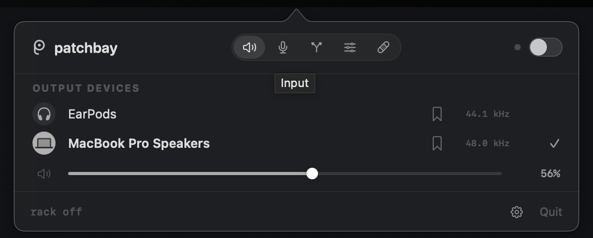
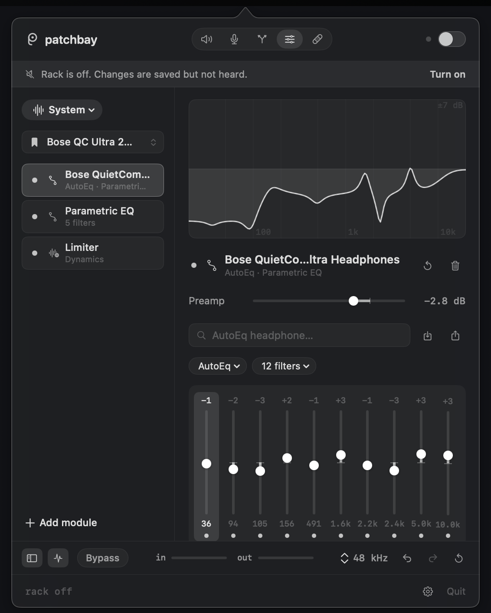

# patchbay.

An open-source effects rack and per-app audio router for the macOS menu bar.

<p align="center">
  
  
</p>

[Download patchbay.dmg](https://github.com/azain47/patchbay/releases/latest/download/patchbay.dmg) ·
[Watch the demo](https://github.com/azain47/patchbay/releases/download/v1.3.0/patchbay-linkedin.mp4) (45 s, silent)

## Install

Apple Silicon, macOS 15 or newer.

1. Open `patchbay.dmg` and drag patchbay into Applications.
2. Open it. macOS blocks the first launch because patchbay isn't signed with a
   paid Apple Developer ID. Go to System Settings → Privacy & Security and
   click *Open Anyway*. (Only if you trust this repo; you can also build it yourself.)
3. Click the menu bar icon and turn the rack on. macOS asks once for System Audio
   Recording permission.

patchbay then updates itself: it checks once a day and asks before installing.
Versions before 1.4.0 need one manual download.

## Features

- **Effects chain** on all system audio, up to 16 modules in any order:
  - Tone: gain, parametric EQ (up to 32 bands), 16-band graphic EQ, filter, loudness
  - Character: bass enhancer, exciter, crystalizer, crusher
  - Dynamics: compressor, expander, gate, de-esser, limiter, maximizer, autogain
  - Space: stereo tools, crossfeed, delay, reverb
- **Headphone correction from one search** across
  [AutoEq](https://github.com/jaakkopasanen/AutoEq) and 130+
  [squig.link](https://squig.link) reviewer databases. Pick a measurement and
  patchbay chooses a Harman or neutral target and fits the EQ (5–32 filters).
- **Per-app routing**: send an app to a different output with its own chain.
- **Per-device chains and presets**: each output remembers its chain; presets can
  load automatically when you switch output.
- **Undo/redo** (⌘Z / ⇧⌘Z), bypass for A/B, live response graph and spectrum.
- **Equalizer APO** `ParametricEQ.txt` import and export.
- **Microphone chain** into a virtual "patchbay Mic" for Zoom, Discord, OBS (optional driver).
- **eqMac recovery** tools on the Fix page.

## How it works

patchbay uses Core Audio process taps instead of a virtual output driver:

```text
system audio (minus routed apps) → system tap → [ chain ] → default device
app A                             → route tap  → [ chain ] → device X
```

- System audio is muted only after patchbay proves it is capturing it, so a
  denied permission can't silence your Mac.
- If patchbay crashes, macOS removes its taps and audio falls back to the real device.
- The audio thread doesn't allocate or lock.

**Microphone:** Settings → *Virtual microphone* → *Install* adds a 90 KB
loopback driver ([BlackHole](https://github.com/ExistentialAudio/BlackHole),
source in `VirtualMic/`) to `/Library/Audio/Plug-Ins/HAL`. It needs your
password and restarts Core Audio for about 3 s. *Remove* uninstalls it.

## Limits

- Input effects need the virtual microphone driver; taps only capture output.
- Don't run it alongside other tap-based apps (FineTune, CoreEQ): results range
  from double latency to silence.

## Build

Needs the Xcode Command Line Tools.

```sh
./build.sh && open patchbay.app
```

The first build downloads [Sparkle](https://sparkle-project.org) 2.10.0 (the
updater) into `.build/`. Builds without the project's signing certificate ask for
audio permission again after each rebuild.

## Releasing

`main` and `staging` accept changes only through pull requests. To release, tag
a commit on `main`; the tag message becomes the release notes:

```sh
git switch main && git pull
git tag -a v1.4.1 -m "## Fixes
- …" && git push origin v1.4.1
```

GitHub Actions builds and signs the app, creates the DMG and update feed, and
publishes the release. Tags on commits that aren't on `main` are rejected.
Required secrets: `SIGNING_P12_BASE64`, `SIGNING_P12_PASSWORD`,
`SPARKLE_PRIVATE_KEY`. If either key is lost, installed copies can't update.

## License

[GPLv3](LICENSE). AutoEq data: MIT, Jaakko Pasanen and contributors.
BlackHole: GPLv3, Existential Audio Inc. Sparkle: MIT, Sparkle Project contributors.
